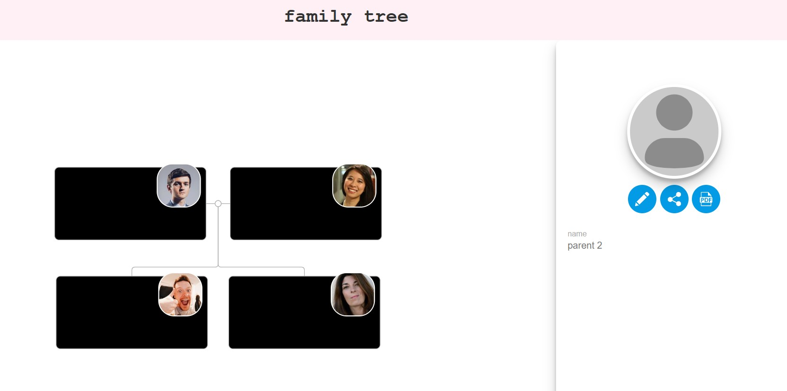

````markdown
# 👨‍👩‍👧‍👦 React Family Chart Integration

A simple React component that renders a Family Chart using [BalkanGraph's FamilyTree.js](https://balkangraph.com/OrgChartJS-Demos/FamilyTree). This example shows a minimal family tree with two parents and their children.

## 🧰 Tech Stack

- React (Hooks + Functional Components)
- FamilyTree.js (via CDN)
- JSON-based data
- JavaScript (ES6)

---

## 📦 Installation

1. Clone the repo:

   ```bash
   git clone https://github.com/LinSchmitz/react-family-chart.git
   cd react-family-chart
   ```
````

2. Install dependencies:

   ```bash
   npm install
   ```

3. Add the FamilyTree.js CDN to your `public/index.html` file (you must do this for it to work):

   ```html
   <script src="https://balkangraph.com/js/familytree.js"></script>
   ```

> 🧠 FamilyTree.js is a commercial library — this demo uses the free version via CDN.

---

## ▶️ Usage

Here's how to use the `SimpleTree` component in your app:

```jsx
import React from 'react';
import SimpleTree from './components/SimpleTree';

function App() {
  return <SimpleTree />;
}

export default App;
```

---

## 🌳 Sample Tree Data

This demo renders the following structure:

```json
[
  { "id": 1, "pids": [2], "name": "parent 1" },
  { "id": 2, "pids": [1], "name": "parent 2" },
  { "id": 3, "fid": 1, "mid": 2, "name": "first child" },
  { "id": 4, "fid": 1, "mid": 2, "name": "second child" }
]
```

- `id`: Unique identifier
- `pids`: Partner/spouse IDs
- `fid`: Father ID
- `mid`: Mother ID

---

## 📂 Project Structure

```
src/
├── components/
│   ├── App.jsx              # Main app entry that renders SimpleTree
│   └── SimpleTree.jsx       # FamilyTree.js chart component
│
├── data/
│   └── SimpleFamilyData.json  # Tree node data in JSON format
```

---

## 🙋‍♂️ Author

**Lin Schmitz**
🔗 [GitHub](https://github.com/LinSchmitz)

---

## 🔗 Useful Links

- 📘 [Official FamilyTree.js Docs](https://balkangraph.com/OrgChartJS-Demos/FamilyTree)
- 🎨 [More Templates](https://balkangraph.com/OrgChartJS-Tutorials/Templates)
- 🛠️ [Customization Guide](https://balkangraph.com/OrgChartJS-Demos/FamilyTree)

```


```

### 📷 Preview


